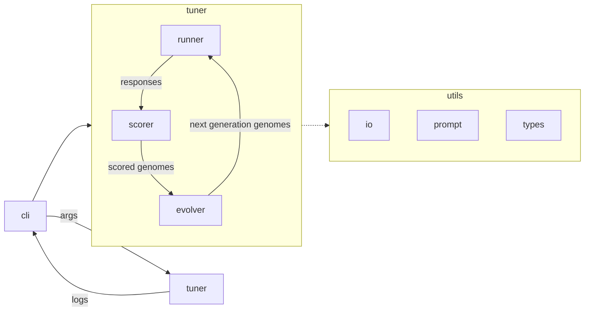

# geneline

Genetic-algorithm automatic tuner for LLM pipeline genomes. Input and output are plain JSON files — no database.

## Architecture



1. **cli** passes paths/args into **tuner** and prints run logs.
2. **runner** executes each genome in the current generation against the input text → responses.
3. **scorer** turns those responses into fitness scores.
4. **evolver** breeds the next generation of genomes (hypers only) and the loop repeats.
5. **utils** (`io`, `prompt`, `types`) are shared helpers used across the package.

Pipeline topology, task prompts, and model names are immutable. Tunable genes: `temperature` and `top_p` only.

## Quick start

```bash
cd geneline
python3 -m pip install -e .
geneline --genome examples/genome.json --message examples/message.txt --config examples/config.json --out runs/latest
```

Or without installing:

```bash
PYTHONPATH=src python3 -m geneline --out runs/latest
```

## Genome shape

Each step is a data-processing stage. Prompts are task templates with exactly one `{{input}}` placeholder (message.txt for step 1, previous step output thereafter) — not role/system personas. `message.txt` is plain input data; instructions live only in the step prompts.

```json
{
  "id": "seed-0",
  "steps": [
    {
      "prompt": "Summarize this text: {{input}}",
      "model": { "name": "mock-balanced", "cost_per_token": 0.00001 },
      "hyperparameters": { "temperature": 0.4, "top_p": 0.9 }
    },
    {
      "prompt": "Extract the main claim from this text: {{input}}",
      "model": { "name": "mock-fast", "cost_per_token": 0.000002 },
      "hyperparameters": { "temperature": 0.3, "top_p": 0.9 }
    }
  ]
}
```

## Outputs

| File | Contents |
|------|----------|
| `best_genome.json` | Winning pipeline genome |
| `best_result.json` | Score, response metrics, stop reason |
| `generation_N_results.json` | All `{genome, score, response}` for generation N |
| `history.json` | Compact per-generation summary + full results |

## Layout

```
examples/                # seed genome, message, tuner config
src/geneline/
  cli.py                 # CLI entrypoint
  tuner.py               # Main loop orchestration
  runner.py              # Runner protocol, mocks, pipeline chaining
  scorer.py              # Multi-objective fitness
  evolver.py             # Selection, crossover, mutation (hypers only)
  utils/
    io.py                # JSON / text file helpers
    prompt.py            # {{input}} template rendering
    types.py             # Genome / Response dataclasses
runs/                    # Written artifacts (gitignored)
```

## Next hooks

- Add an OpenRouter (or other) `Runner` behind the same protocol; keep `MockRunner` / `ScriptedRunner` for tests.
- Plug in a task-specific quality scorer instead of the mock overlap metric.
- Allow prompt mutation once you want the genome’s text genes to evolve.
